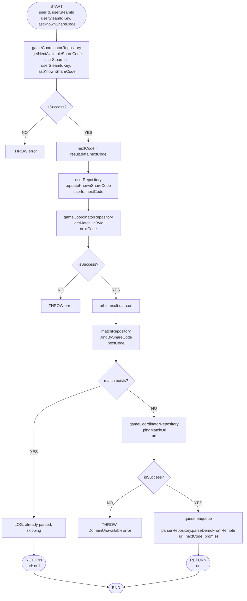

# Block Schema: DownloadAndParseDemoCommandHandler

## Context

Classic block diagram (flowchart) of the algorithm inside `DownloadAndParseDemoCommandHandler`. No code changes required.

---

## Algorithm Block Diagram

---

## Error Paths Summary

| Step | Condition | Action |
|------|-----------|--------|
| getNextAvailableShareCode | `!isSuccess` | throw error |
| getMatchUrlById | `!isSuccess` | throw error |
| findByShareCode | match exists | return `{ url: null }` (normal skip path) |
| pingMatchUrl | `!isSuccess` | throw `DomainUnavailableError` |

---

## Files Referenced

- `backend/domain/src/handlers/DownloadAndParseDemoCommandHandler.ts`
- `backend/domain/src/ports/outbound/` — `GameCoordinatorOutboundPort`, `MatchOutboundPort`, `UserOutboundPort`, `ParserOutboundPort`, `QueueOutboundPort`
